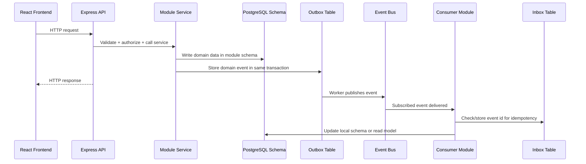

# Event Driven Architecture Diagram

```mermaid
flowchart TB
  client["Frontend App<br/>React + Vite + TypeScript"]
  api["Node.js + Express Server<br/>src/server.ts / src/app.ts"]
  middleware["Global Middleware<br/>auth, RBAC, validation, error handling"]

  subgraph modules["Backend Modules<br/>src/modules"]
    auth["auth module<br/>routes, controller, service, repository<br/>events: UserLoggedIn, UserLoggedOut"]
    users["user-management module<br/>routes, controller, service, repository<br/>events: UserCreated, UserUpdated"]
    rbac["rbac module<br/>roles, permissions, guards<br/>events: RoleAssigned, PermissionGranted"]
    university["university module<br/>tenant onboarding, settings<br/>events: UniversityCreated"]
    config["configuration module<br/>rules, feature flags<br/>events: ConfigurationUpdated"]
    dashboard["dashboard module<br/>read models, KPI aggregation<br/>consumes domain events"]
    audit["audit module<br/>audit logs, compliance logs<br/>consumes all domain events"]
    notifications["notification module<br/>alerts, announcements<br/>events: NotificationSent"]
    students["student module<br/>student records, profile, status<br/>events: StudentCreated, StudentUpdated"]
    faculty["faculty module<br/>faculty records, assignments<br/>events: FacultyCreated"]
    departments["department module<br/>academic departments<br/>events: DepartmentCreated"]
    programs["program module<br/>degree programs<br/>events: ProgramCreated"]
    courses["course module<br/>courses and subjects<br/>events: CourseCreated"]
    batches["batch module<br/>student cohorts<br/>events: BatchCreated"]
    timetable["timetable module<br/>class scheduling<br/>events: ClassScheduled"]
    attendance["attendance module<br/>attendance marking<br/>events: AttendanceMarked"]
    assessments["assessment module<br/>exams, quizzes, assignments<br/>events: AssessmentSubmitted"]
    results["result module<br/>academic results<br/>events: ResultPublished"]
    fees["fee module<br/>fee structures and waivers<br/>events: FeeAssigned"]
    payments["payment module<br/>collections and refunds<br/>events: PaymentCompleted"]
    reports["reporting module<br/>exports and reports<br/>consumes business events"]
    analytics["analytics module<br/>trends and insights<br/>consumes business events"]
  end

  subgraph db["PostgreSQL Primary Database<br/>schema-per-module"]
    authDb["auth schema"]
    usersDb["user_management schema"]
    rbacDb["rbac schema"]
    universityDb["university schema"]
    configDb["configuration schema"]
    academicDb["academic schemas<br/>students, faculty, departments,<br/>programs, courses, batches"]
    opsDb["operations schemas<br/>timetable, attendance,<br/>assessments, results"]
    financeDb["finance schemas<br/>fees, payments"]
    readDb["read model schemas<br/>dashboard, reports, analytics"]
    auditDb["audit schema"]
    outbox["event_outbox schema/table<br/>reliable event publishing"]
    inbox["event_inbox schema/table<br/>idempotent event consumption"]
  end

  bus["Event Bus / Message Broker<br/>Kafka, RabbitMQ, Redis Streams, etc."]
  worker["Event Workers<br/>publish outbox events<br/>consume subscribed events"]

  client --> api
  api --> middleware
  middleware --> modules

  auth --> authDb
  users --> usersDb
  rbac --> rbacDb
  university --> universityDb
  config --> configDb
  students --> academicDb
  faculty --> academicDb
  departments --> academicDb
  programs --> academicDb
  courses --> academicDb
  batches --> academicDb
  timetable --> opsDb
  attendance --> opsDb
  assessments --> opsDb
  results --> opsDb
  fees --> financeDb
  payments --> financeDb
  dashboard --> readDb
  reports --> readDb
  analytics --> readDb
  audit --> auditDb
  notifications --> usersDb

  modules --> outbox
  worker --> outbox
  worker --> bus
  bus --> worker
  worker --> inbox
  worker --> modules

  bus -. "UserCreated" .-> rbac
  bus -. "UserCreated" .-> dashboard
  bus -. "UserCreated" .-> notifications
  bus -. "UniversityCreated" .-> config
  bus -. "UniversityCreated" .-> users
  bus -. "StudentCreated" .-> dashboard
  bus -. "StudentCreated" .-> notifications
  bus -. "ClassScheduled" .-> attendance
  bus -. "AssessmentSubmitted" .-> results
  bus -. "FeeAssigned" .-> payments
  bus -. "PaymentCompleted" .-> analytics
  bus -. "All Domain Events" .-> audit
  bus -. "Business Events" .-> reports
```



## Suggested Backend Folder Layout

```text
src/
  app.ts
  server.ts
  config/
    env.ts
    database.ts
  db/
    prisma.ts
    migrations/
  shared/
    middleware/
    errors/
    validation/
    events/
      event-bus.ts
      event-types.ts
      outbox.publisher.ts
      inbox.consumer.ts
  modules/
    auth/
      auth.routes.ts
      auth.controller.ts
      auth.service.ts
      auth.repository.ts
      auth.events.ts
      auth.types.ts
    user-management/
    rbac/
    university/
    configuration/
    dashboard/
    audit/
    notifications/
    students/
    faculty/
    departments/
    programs/
    courses/
    batches/
    timetable/
    attendance/
    assessments/
    results/
    fees/
    payments/
    reporting/
    analytics/
  workers/
    event-publisher.worker.ts
    event-consumer.worker.ts
```

## Event Flow


